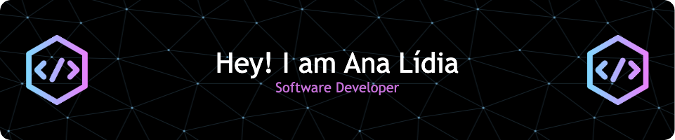

 

<!-- <h2 align="center">Hi there! I'm Ana Lídia &nbsp;</h2>  -->
 

## 💭 About me
I'm a Software Developer. Currently, I am working as a React Native developer, but I am also very interested in Native Development (Swift) and i'm having a bunch of fun making some personal projects using it.

📚 Studying Digital Systems and Media - [UFC](https://smd.ufc.br/pt/)

  ## 💻 Skills

  
  
  
  
  
  
  

  
 ## GitHub Stats 📈

## 👥 Connect With Me 
<base target="_blank" rel="noopener noreferrer">

 
 	
   
 
 
 
 

